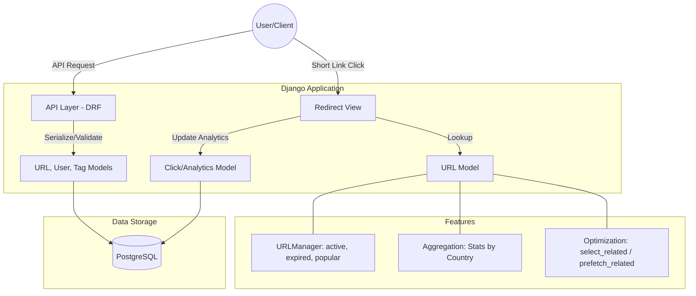

# URL Shortener Django Service

Production-oriented URL shortener MVP built with Django, Django REST Framework, Docker, and Postgres.

## Architecture

The project is intentionally modular:

- `core`: shared foundational app (reserved for shared primitives)
- `shortener`: URL domain model, redirect logic, and code generation services
- `api`: REST endpoints for URL creation
- `config`: project-level settings and URL routing

Key capabilities:

- `POST /api/urls/` to create short URLs
- `GET /<short_code>/` to issue HTTP `302` redirects
- OpenAPI schema + Swagger UI with `drf-spectacular`
- `python-decouple`-based configuration (`SECRET_KEY`, `DEBUG`, `DATABASE_URL`)

## Local setup (without Docker)

```bash
python3 -m venv .venv
source .venv/bin/activate
pip install -r requirements.txt
cp .env.example .env
python manage.py migrate
python manage.py runserver
```

## Docker setup

```bash
cp .env.example .env
docker compose up --build
```

Services:

- Django app: http://localhost:8000
- Swagger docs: http://localhost:8000/api/docs/
- OpenAPI schema: http://localhost:8000/api/schema/

## Code quality hooks (pre-commit)

This repository uses `pre-commit` hooks for:

- `black` (formatting)
- `ruff` (linting)
- `mypy` (type checks)

Install and enable hooks:

```bash
pip install -r requirements.txt
pre-commit install
```

Run hooks manually for all files:

```bash
pre-commit run --all-files
```

Run individual checks:

```bash
black .
ruff check .
mypy .
```

## API usage

### Create short URL

`POST /api/urls/`

Request:

```json
{
  "original_url": "https://example.com/my/very/long/url"
}
```

Response (`201`):

```json
{
  "short_code": "aB12Cd",
  "original_url": "https://example.com/my/very/long/url"
}
```

### Redirect

`GET /aB12Cd/` returns `302` to the original URL.

## Environment variables

Use `.env` with:

- `SECRET_KEY`
- `DEBUG`
- `ALLOWED_HOSTS`
- `DATABASE_URL`

Example values are provided in `.env.example`.



